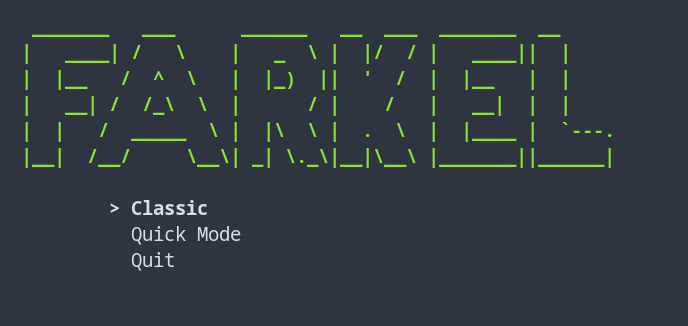

# Farkel

Simple (and kinda unfinished) terminal implementation of [Farkel](https://en.wikipedia.org/wiki/Farkle), written in Rust.

## Demo



## How to Play

```
$ git clone <THIS_REPO>
$ cd farkel
$ cargo run --release
```

You can quit the game on your turn with `q` or `Esc`